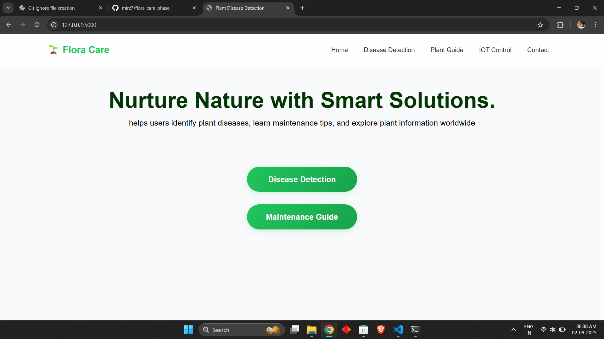
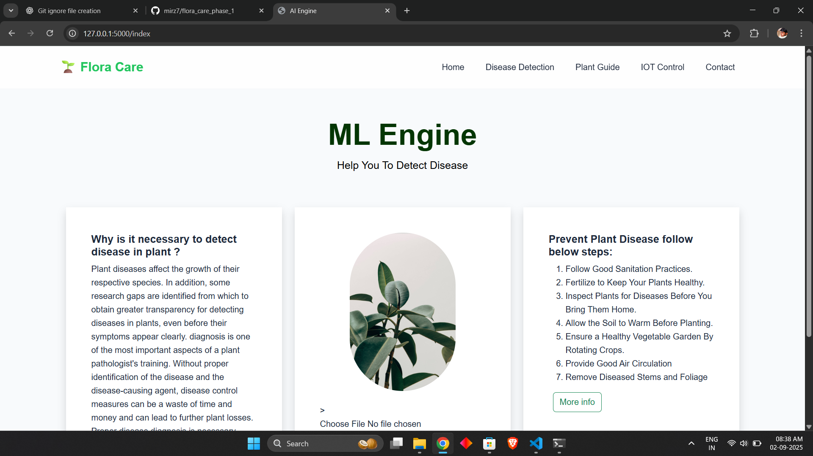
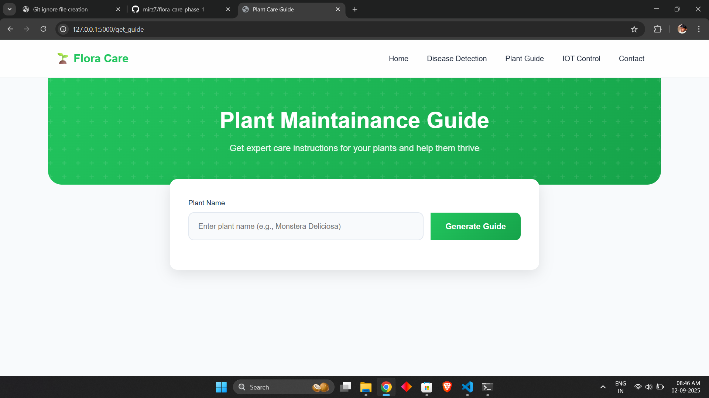
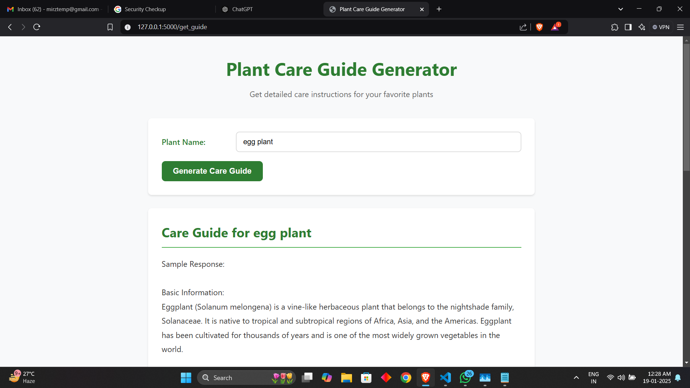

Got it 🌱 Since your **FloraCare** project is in the **initial stage** (Flask backend + some photos), I’ll draft a clean and professional `README.md` that you can improve later as you add IoT, ML, and other features.

Here’s a suggested **README.md** for your repo:

---

# 🌱 FloraCare

FloraCare is an intelligent plant disease detection and care assistant.
Currently, the project is in its **initial stage**, built with **Flask** to serve as the backend and provide a foundation for integrating machine learning and IoT features in the future.

---

## 🚀 Features (Current Stage)

* Flask-powered web application
* Upload plant images for testing (demo only)
* Basic templates for UI
* Initial dataset and CSV-based information
* Organized project structure with static & templates folders
* Detailed plant care using hugging face
---

## 📸 Screenshots


### 🌱 Home Page


### 🔍 Detection 


### ⚙️ care page

### ⚙️ Care guide



## 🔮 Roadmap

Planned upcoming features:

* ✅ Plant disease detection using deep learning (CNN)
* ✅ Plant guide generation (AI-powered)
* ✅ IoT device integration (ESP32 + soil/moisture sensors)
* ✅ Community feature (users can post/share tips)
* ✅ Deployment on cloud for real-world usage

---

## 🛠️ Tech Stack

* **Backend:** Flask (Python)
* **Frontend:** HTML, CSS, Bootstrap (inside templates)
* **Data:** CSV demo data & test images
* **Deployment:** Heroku (Procfile included)

---

## 📂 Project Structure

```
Plant-Disease-Detection/
│── Flask Deployed App/
│   ├── static/            # Static files (CSS, JS, images)
│   ├── templates/         # HTML templates
│   ├── app.py             # Flask app
│   ├── models.py          # ML model integration (future)
│   ├── config.py
│   ├── requirements.txt
│   └── Procfile           # For deployment
│
├── demo_images/           # Sample plant images
├── test_images/           # Testing dataset
├── Model/                 # Placeholder for trained models
├── README.md
└── .gitignore
```

---

## ⚙️ Installation & Usage

1. Clone the repo:

```bash
git clone https://github.com/your-username/FloraCare.git
cd FloraCare
```

2. Create a virtual environment:

```bash
python -m venv venv
venv\Scripts\activate   # On Windows
source venv/bin/activate  # On Linux/Mac
```

3. Install dependencies:

```bash
pip install -r requirements.txt
```

4. Run the Flask app:

```bash
python app.py
```

5. Open in browser:

```
http://127.0.0.1:5000
```

---

## 🤝 Contributing

This project is still in its early stages. Contributions are welcome once the base is stable!

---

## 📜 License

MIT License

---

⚡ This keeps it **minimal but professional** for now, while leaving room for growth when you add ML & IoT.

👉 Do you want me to also add a **project logo/banner** (like “FloraCare” with a plant icon) at the top of the README? That makes it look cooler on GitHub.
